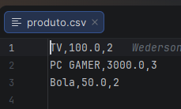

## Leitura e Escrita de Arquivos Em JAVA

Este é um projeto desenvolvido como exercício de curso, com o objetivo de praticar leitura e escrita de arquivos utilizando Java.

O projeto demonstra o uso de:

- BufferedReader e FileReader para leitura
- BufferedWriter e FileWriter para escrita
- Manipulação de arquivos CSV
- Estrutura básica de organização de projeto Java

---

## Estrutura do Projeto

FileReader-Writer/
│
├── src/
│   ├── Main.java        # Classe principal para execução
│   ├── Produto.java     # Classe modelo representando um produto
│   ├── ArquivoService.java   # Classe responsável pela metodo de criacao de produto e somatorio
│   └── EscritorCSV.java # Classe responsável pela leitura de arquivos
│
├── csvs/
│   │└──saida/
│   │    ├── somatorio.csv  #arquivo utilizado para armazenar somatoria dos produtos
│   └── produto.csv     # Arquivo CSV utilizado para armazenar produtos
│
└── README.md

---

## Funcionalidades

- Escrita de dados em arquivo CSV
- Organização simples e clara do código

---

## Como Rodar

1. Abra o projeto em uma IDE Java (IntelliJ, Eclipse, etc).
2. Certifique-se de ter um JDK configurado (Java 17 ou superior recomendado).
3. organize o caminho das pastas para pasta da sua escolha
4. Execute a classe `Main.java`.

---

## Observações

Este projeto foi desenvolvido como exercício prático de curso para reforçar conceitos de:

- Manipulação de arquivos
- Estruturação de código
- Boas práticas básicas em Java
- Uso correto de caminhos relativos (evitando caminhos absolutos)

---

## Demonstração

### 📌 Print 1 – Produto.csv

### 📌 Print 2 – Execução no Terminal

### 📌 Print 3 – Somatorio.csv

